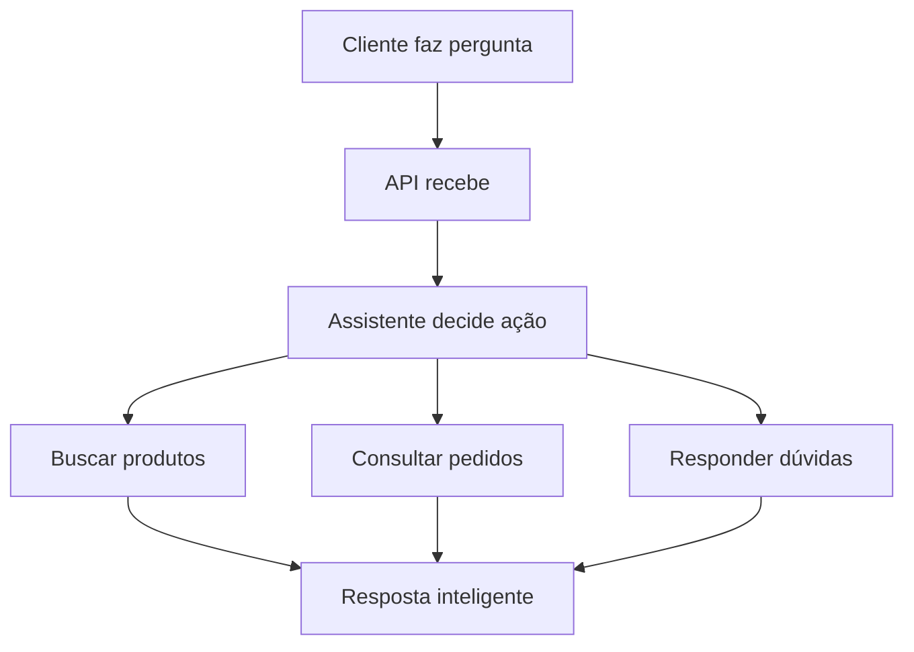

# 🎯 Projeto Final - Assistente Virtual Personalizado

## 📋 Sobre o Projeto

Este é o projeto final do curso, onde você aplicará todo o conhecimento adquirido nas 9 aulas anteriores para construir um assistente virtual completo e funcional.

### Objetivo
Desenvolver um assistente virtual inteligente para e-commerce que auxilia clientes em:
- Busca de produtos
- Resolução de dúvidas sobre pedidos
- Suporte ao cliente

### Justificativa
Este projeto simula um cenário real do mercado e integra todos os conceitos estudados:
- RAG (Retrieval Augmented Generation)
- Embeddings
- APIs
- Prompt Engineering
- Deploy
- Monitoramento

## 🎯 Funcionalidades Obrigatórias

### 1. Busca Inteligente de Produtos
- Busca semântica de produtos
- Filtros por preço e características
- Exemplo: "Quero um notebook para programar, até R$ 3.000"

### 2. Políticas da Loja
- Informações sobre trocas e devoluções
- Prazos de entrega
- Exemplo: "Como faço para trocar um produto?"

### 3. Consulta de Pedidos
- Status de pedidos
- Cancelamentos
- Exemplo: "Cadê meu pedido #12345?"

### 4. Recomendações Personalizadas
- Sugestões baseadas em preferências
- Exemplo: "O que vocês recomendam para quem gosta de tecnologia?"

## 🏗️ Arquitetura do Sistema



## 📚 Tecnologias Utilizadas

### Core
- **LangChain** - Framework principal
- **OpenAI API** - Geração de respostas
- **FAISS/Pinecone** - Busca vetorial
- **FastAPI** - Backend API
- **Docker** - Containerização

### Deploy (Escolha uma)
- Render (mais fácil, gratuito)
- Railway (fácil, barato)
- AWS/GCP (mais profissional)

## 📁 Estrutura do Projeto

```
meu-assistente-virtual/
├── src/
│   ├── assistente.py          # Lógica principal
│   ├── rag_system.py          # Sistema RAG
│   ├── api.py                 # FastAPI endpoints
│   └── prompts.py             # Templates
├── data/
│   ├── produtos.json          # Catálogo
│   ├── pedidos.json           # Base de pedidos
│   └── politicas.md           # Documentos
├── deploy/
│   ├── Dockerfile
│   └── requirements.txt
├── README.md
└── .env
```

## 📊 Dados Necessários

### 1. Catálogo de Produtos
```json
{
  "id": "PROD001",
  "nome": "Notebook Dell Inspiron 15",
  "categoria": "Eletrônicos",
  "preco": 2899.99,
  "descricao": "Notebook ideal para trabalho e estudos...",
  "especificacoes": {
    "tela": "15.6 polegadas",
    "processador": "Intel i5",
    "memoria": "8GB RAM"
  },
  "disponivel": true
}
```

### 2. Base de Conhecimento
- Política de trocas e devoluções
- Prazos de entrega por região
- Formas de pagamento
- Garantias
- Contato e suporte

### 3. Pedidos de Exemplo
```json
{
  "pedido_id": "12345",
  "status": "Em trânsito",
  "produtos": [...],
  "data_compra": "2024-01-15",
  "previsao_entrega": "2024-01-20"
}
```

## 🧪 Testes Obrigatórios

1. **Busca de Produtos**
   - Input: "Quero um smartphone Android, tela grande, até R$ 1.500"
   - Output: Lista de smartphones compatíveis

2. **Políticas**
   - Input: "Posso trocar um produto depois de 15 dias?"
   - Output: Explicação da política de trocas

3. **Status de Pedido**
   - Input: "Meu pedido #12345 já saiu para entrega?"
   - Output: Status atual e previsão

4. **Recomendação**
   - Input: "Que presente vocês sugerem para uma pessoa que gosta de cozinhar?"
   - Output: Produtos relacionados à culinária

5. **Conversa Natural**
   - Input: "Oi, tudo bem? Estou procurando um presente para minha mãe"
   - Output: Saudação amigável + ajuda personalizada

## 📅 Cronograma

### Semana 1: Base do Sistema (15h)
- Configuração do ambiente (2h)
- Criação dos dados (4h)
- Implementação do RAG básico (5h)
- API inicial (4h)

### Semana 2: Inteligência e Integração (10h)
- Sistema de decisões (4h)
- Melhoria das respostas (3h)
- Integração completa (3h)

### Semana 3: Deploy e Finalização (10h)
- Preparação para produção (4h)
- Deploy (3h)
- Documentação e melhorias (3h)

## 📈 Critérios de Avaliação

| Critério | Peso | Descrição |
|----------|------|-----------|
| Funcionalidade | 30% | Todas as 5 funções funcionando |
| Qualidade RAG | 25% | Respostas precisas e relevantes |
| Código e Estrutura | 20% | Organização, documentação, boas práticas |
| Deploy | 15% | Aplicação funcionando online |
| Inovação | 10% | Funcionalidades extras criativas |

## 💡 Funcionalidades Extras Sugeridas

- Interface web para testes
- Histórico de conversas por usuário
- Análise de sentimento do cliente
- Notificações por webhook
- Dashboard com métricas
- Suporte a múltiplos idiomas
- Integração com WhatsApp

## 🎯 Dicas para Sucesso

### Faça
- Comece com o básico
- Teste constantemente
- Documente tudo
- Peça ajuda quando necessário
- Seja criativo

### Evite
- Começar pela parte mais difícil
- Deixar testes para o final
- Negligenciar a documentação
- Buscar perfeição imediata
- Não fazer backup do código

## 🆘 Suporte

- Material das aulas
- Documentação oficial (LangChain, FastAPI, OpenAI)
- Grupo da turma
- Stack Overflow
- GitHub

## 🏆 Critérios de Excelência

- Testes automatizados
- Tratamento de erros robusto
- Performance otimizada
- Experiência do usuário fluida
- Deploy profissional
- Documentação completa

---

> 💪 Este projeto é seu portfólio! Capriche na implementação e documentação.